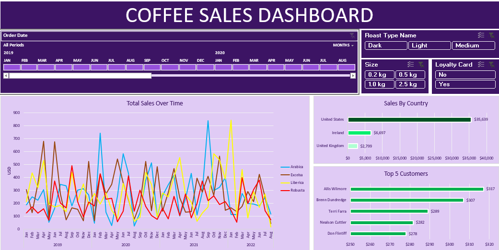

# Coffee Sales Performance Dashboard (Excel)

An interactive Excel dashboard designed to analyze and visualize global coffee sales data from 2019 to 2022. This project demonstrates end-to-end data processing, ETL, advanced formula usage, and data visualization best practices.

## Dashboard Preview

##  Key Skills & Features Demonstrated
* **Dynamic Data Filtering:** Implemented interactive **Slicers** (Roast Type, Coffee Size, Loyalty Card Status) and an **Order Date Timeline** to allow users to drill down into specific timeframes and product segments.
* **Advanced Data Cleaning & Modeling:** Handled raw sales tables by parsing out product data, calculating currency fields, and standardizing dates.
* **Pivot Tables & Charts:** Aggregated thousands of rows of data into structured, easy-to-digest visual charts.

## Insights From the Data
* **Sales Trends over Time:** Tracked performance across 4 main bean types (*Arabica, Excelsa, Liberica, Robusta*). While sales fluctuate seasonally, specific peaks are visible in late 2020 and mid-2021 across various roast profiles.
* **Geographical Performance:** The **United States** represents the primary market driver by a massive margin, bringing in **$35,639** in revenue, followed by Ireland ($6,697) and the United Kingdom ($2,799).
* **Top Customer Value:** Identified the highest-spending loyal customers, led by *Allis Wilmore ($317)* and *Brenn Dundredge ($307)*, proving the value of targeted loyalty card metrics.

## Repository Contents
* `coffeeOrdersData.xlsx`: The raw transactional dataset used as the data source.
* `coffeeOrdersProject.xlsx`: The final workbook containing data transformations, pivot tables, and the dynamic dashboard layout.
* `dashboard_preview.png.png`: Dashboard screenshot for the repository preview.
* `README.md`: Project summary and portfolio documentation.
